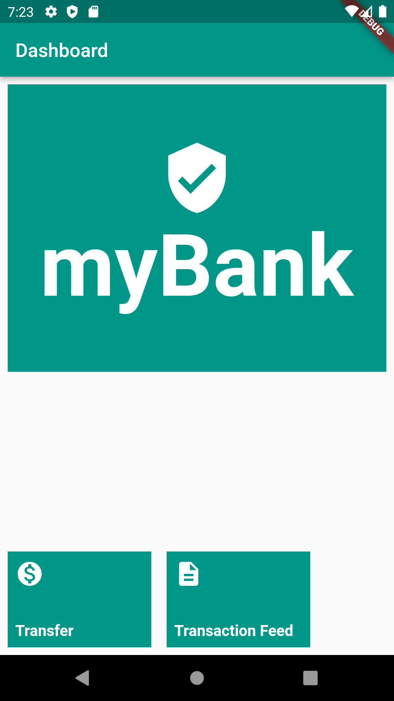
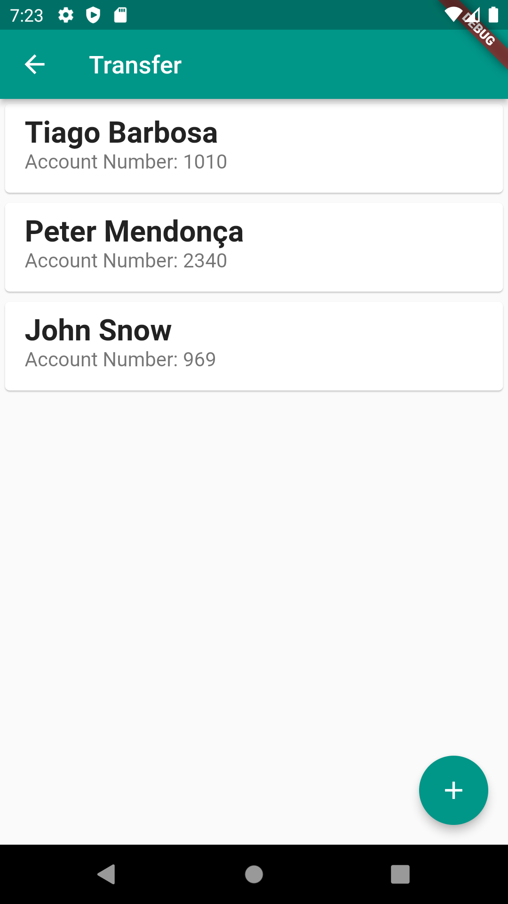
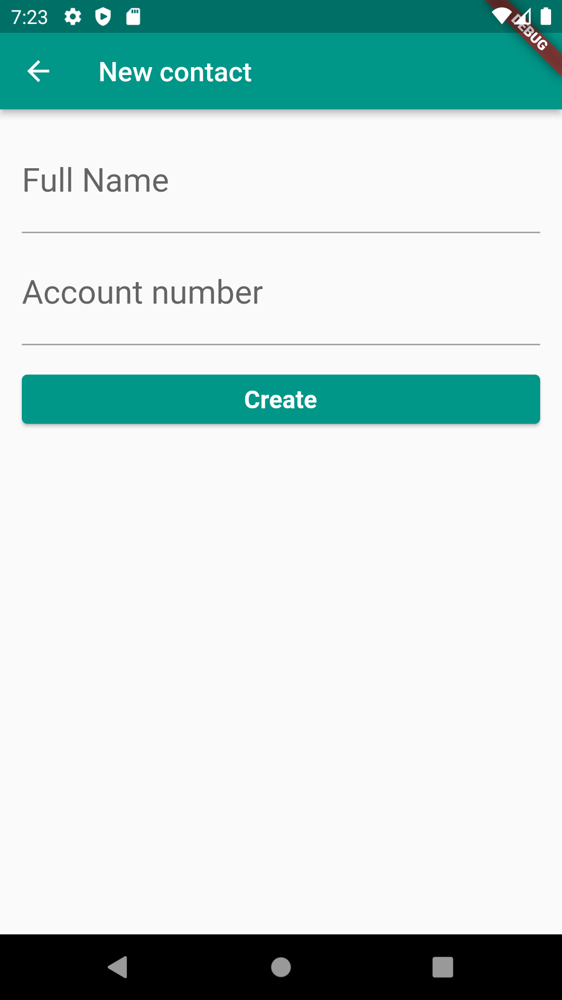
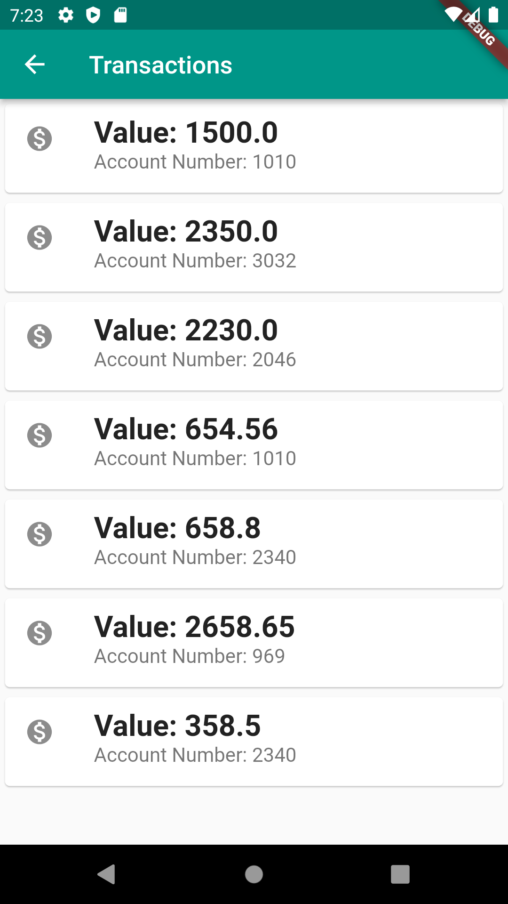

# Flutter - Streams de programação reativa com BLoC

> **obs1.:** Para uso do webApi de exemplo, vá a pasta **WebApiStudies** e no arquivo README tem toda a descrição de utilização.
> 
> **obs2.:** Senha padrão para transferências é o valor 1000. 
> 
> **obs3.:** Alterar a url do `webclient.dart` para o seu ip local `const String baseUrl = 'http://<IP DA SUA MAQUINA AQUI>:8080/transactions';`

## Objetivos ao completar os estudos
- Crie seus blocs e cubit
- Gerencie o seu estado
- Crie um framework para gerenciamento de estado
- Separe UI, estado e eventos
- Lide com a assincronicidade no meio de uma tela

## Ementas:

### Bloc e flutter bloc
- Quando usar BloC?
- Configurando o projeto e extração inicial
- Versão do Flutter BloC
- Gerenciador de estado, interface com o usuário e container
- Bloc Pattern
- Tela de alteração de nome
- Renomeando o context
- Faça como eu fiz
- O que aprendi?
  - Criando seus blocs e cubit
  - BlocProvider, BlocConsumer, BlocBuilder
  - Cubit
  - Gerenciando seu estado
  - Primitivo e objeto como estado

### Integrando telas
- Integrando telas
- Outros tipos de widgets de bloc
- Faça como eu fiz
- O que aprendi?

### Criando um framework
- Lembrando como o estado funciona
- Estados, telas e polimorfismo
- Faça como eu fiz
- O que aprendi?

### Formulários e bloc
- Envio e sucesso assíncrono com bloc
- Formulários e bloc
- Finalizando com build e listeners distintos
- Faça como eu fiz
- Projeto completo do curso
- Para saber mais: Documentação
- Conclusão
- O que aprendi?

***

## Flutter project screens - myBank App
<!-- 

 -->
